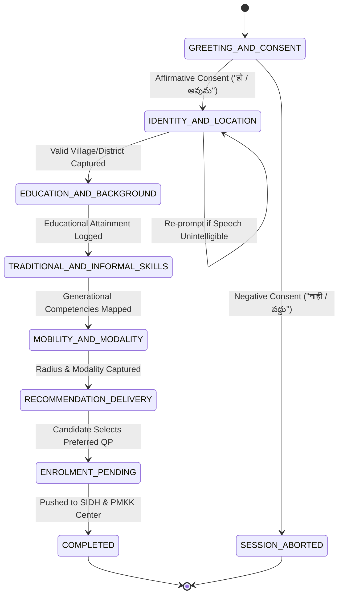

# **KaushalVaani (कौशलवाणी): AI-Driven Multilingual Voice-First Livelihood Counsellor**
### **National Comprehensive Project Dossier & Technical Blueprint**
**Smart India Hackathon (SIH) 2026**  
* **Problem Statement ID:** `SIH26097`  
* **Problem Statement Title:** AI-Driven Voice Assistant for Livelihood Mapping and NSQF-Aligned Skilling Recommendations for SC Communities under GIA component of PM-AJAY  
* **Theme:** Agriculture, FoodTech & Rural Development  
* **Category:** Software  
* **Nodal Ministry:** Ministry of Social Justice and Empowerment (MoSJE), Government of India  
* **Implementing Framework:** Pradhan Mantri Anusuchit Jaati Abhyuday Yojana (PM-AJAY) – Grant-in-Aid (GIA) Component  
* **Team ID:** `162048`  
* **Team Name:** `Vertex_1`  
* **Document Version:** 2.0 (Official Hackathon & Institutional Standard)

---

## **Table of Contents**
1. [Executive Overview & Problem Definition](#1-problem-definition--institutional-background)
   - 1.1 Context of PM-AJAY & The GIA Component
   - 1.2 Core Challenges Faced by Scheduled Caste (SC) Beneficiaries
   - 1.3 Key Bottlenecks in the Official Problem Statement
   - 1.4 Target Personas & Dialect Demographics
2. [The Proposed Solution: KaushalVaani](#2-the-proposed-solution-kaushalvaani)
   - 2.1 Product Vision & Core Paradigm Shift
   - 2.2 The 4-Step Conversational Lifecycle (Speak → Profile → Match → Advise)
   - 2.3 Omnichannel Ingestion Strategy (IVR, WhatsApp, CSC Kiosk, Mobile PWA)
   - 2.4 Addressing GIA Bottlenecks: Problem-to-Feature Mapping Matrix
   - 2.5 Innovation & Distinct Value Propositions
3. [Technology Stack & Architectural Specifications](#3-technology-stack--system-architecture)
   - 3.1 Modular Multi-Tier Architecture Diagram
   - 3.2 Speech & Linguistic Processing Layer (Digital India Bhashini)
   - 3.3 Conversational Orchestration & Dialogue State Machine
   - 3.4 Multi-Factor Mathematical Recommendation Algorithm
   - 3.5 Database & Persistence Architecture (Hybrid Relational + Document Store)
   - 3.6 Hardware, Channel & Telephony Infrastructure
4. [End-to-End Operational Workflow](#4-end-to-end-operational-workflow)
   - 4.1 Step-by-Step Beneficiary Journey
   - 4.2 Conversational State Machine Execution Flow
   - 4.3 Automated Verification, Fallback & Ground Volunteer ("Sathi") Handshake
   - 4.4 Government Interoperability Pipeline (SIDH, e-Shram, LGD, PFMS)
5. [Feasibility, Viability & Risk Analysis](#5-feasibility-viability--risk-analysis)
   - 5.1 Technical Feasibility Analysis
   - 5.2 Operational & Economic Viability (Zero-Hardware Burden)
   - 5.3 Risk Matrix & Mitigation Strategies
   - 5.4 Phased Implementation & Rollout Roadmap (Phase 1 to Phase 3)
6. [Impact, Benefits & Policy Alignment](#6-impact-benefits--policy-alignment)
   - 6.1 Quad-Dimensional Impact (Social, Economic, Governance, Environmental)
   - 6.2 Key Performance Indicators (Target KPIs & Evaluation Metrics)
   - 6.3 National Strategic Policy Alignment (PM-AJAY, Skill India, Viksit Bharat 2047, DPDP Act 2023)
7. [Research, Datasets & References](#7-research-datasets--references)
   - 7.1 Primary Datasets Employed in the Project
   - 7.2 Regulatory & Policy Framework References
   - 7.3 Technical Literature & Linguistic Models

---

# **1. Problem Definition & Institutional Background**

### **1.1 Context of PM-AJAY & The GIA Component**
The **Pradhan Mantri Anusuchit Jaati Abhyuday Yojana (PM-AJAY)** is a flagship centrally sponsored scheme by the **Ministry of Social Justice and Empowerment (MoSJE)**, aimed at the socio-economic empowerment of Scheduled Caste (SC) communities across India. It merges three erstwhile central schemes:
1. Pradhan Mantri Adarsh Gram Yojana (PMAGY)
2. Special Central Assistance to Scheduled Castes Sub Plan (SCA to SCSP)
3. Babu Jagjivan Ram Chhatrawas Yojana (BJRCY)

Under its **Grant-in-Aid (GIA) component**, the government provides targeted financial grants and institutional backing for:
* Comprehensive skill development training aligned with the **National Skills Qualifications Framework (NSQF)**.
* Income-generating micro-enterprises and self-employment asset generation.
* Creation of community infrastructure and market linkages in aspirational districts with significant SC population concentration (≥ 50% or clusters with high SC density).

### **1.2 Core Challenges Faced by Scheduled Caste (SC) Beneficiaries**
Despite substantive fiscal allocations, ground-level surveys and administrative evaluations reveal significant leakages and dropouts due to structural barriers:
* **The Literacy & Digital Divide:** Over 65% of rural SC target candidates possess limited formal schooling (matriculation or below) and cannot decipher complex, bureaucratic, multi-page textual application forms in English or formal Sanskritized/formal Hindi.
* **Dialectal Disconnection:** Standard administrative tools communicate in official state languages, whereas beneficiaries speak rural, localized dialects (e.g., Ahirani / Khandeshi in North Maharashtra, colloquial Telangana/Rayalaseema Telugu, Gondi, Santhali).
* **Aspiration vs. Allotment Mismatch:** Trainees are routinely herded into generic training courses (such as generic computer typing or basic data entry) without auditing their generational trade competencies, raw aptitude, or personal ambitions.
* **Geographical & Mobility Constraints:** Female candidates and marginal landless laborers cannot travel 40–60 km daily to urban skilling hubs due to childcare responsibilities, safety, and lack of affordable transit.
* **The Skilling-to-Livelihood Disconnect:** Skilling programs frequently operate disconnected from local market demand; trainees complete certifications only to find zero vacancies or self-employment market opportunities in their home blocks, leading to high post-training attrition.

### **1.3 Key Bottlenecks Identified in Problem Statement SIH26097**
The official SIH26097 Problem Statement isolates specific operational deficits in the PM-AJAY GIA pipeline:
1. **Absence of Grounded Perspective Planning:** District authorities lack bottom-up, granular demand aggregation. Annual Action Plans (AAPs) are drafted using outdated aggregate statistics rather than direct candidate aspirations.
2. **Scarcity of Qualified Mentors & Financial Facilitators:** Rural beneficiaries cannot discover certified mentors, trainers, or credit-linkage consultants to leverage GIA capital subsidies.
3. **Severe Post-Training Dropouts & Inadequate Job Placements:** Absence of real-time post-skilling follow-up leads to wasted capacity and low return on public expenditure.
4. **Inter-Departmental Silos:** Line departments (Social Welfare, Skill Development, MSME, Rural Development) operate separate portals, forcing candidates to repeatedly prove identity and eligibility.
5. **Weak Ground-Level Enablement:** Overburdened district officers cannot provide personalized one-on-one career counselling to tens of thousands of dispersed candidates.

### **1.4 Target Personas & Dialect Demographics**

```
+----------------------------------------------------------------------------------------------------+
|                                    TARGET BENEFICIARY PROFILES                                     |
+------------------------------------+---------------------------------------------------------------+
| Persona A: Low-Literacy Farmer     | Persona B: Rural Artisan / Youth Novice                       |
| Name: Ramesh Patil                 | Name: Lakshmi Devi                                            |
| Age: 34 | Gender: Male             | Age: 22 | Gender: Female                                      |
| Location: Avadhan, Dhule, MH       | Location: Mangalagiri Rural, Guntur, AP                       |
| Dialect: Ahirani (ahr-IN)          | Dialect: Colloquial Telugu (te-IN)                            |
| Education: Class 8th Pass          | Education: Class 10th Pass                                    |
| Device: Basic 2G Feature Phone     | Device: Budget Android Smartphone (WhatsApp-only)             |
| Generational Trade: Cotton Farming | Generational Trade: Traditional Handloom Weaving              |
| Constraint: Travel <= 10 km        | Constraint: Travel <= 20 km, requires daycare/safe transport   |
| Modality: Micro-Enterprise / Self  | Modality: Hybrid (Cooperative Piecework + Self-Help Group)    |
+------------------------------------+---------------------------------------------------------------+
```

---

# **2. The Proposed Solution: KaushalVaani**

### **2.1 Product Vision & Core Paradigm Shift**
**KaushalVaani (कौशलवाणी — "Voice of Skills")** is an empathetic, AI-orchestrated, dialect-aware conversational livelihood counsellor engineered specifically for PM-AJAY GIA beneficiaries.

```
Traditional Paradigm:
Bureaucratic Form -> English/Formal State Language -> Generic Allocation -> High Dropout & Disillusionment

KaushalVaani Paradigm:
Empathetic Dialect Voice Call -> Holistic Profiling -> Multi-Factor Mathematical Match -> Spoken Pathways + Direct SIDH Enrollment
```

KaushalVaani transforms bureaucratic administration into a warm, natural village conversation. Beneficiaries do not type, browse portals, or navigate dropdown menus. Instead, they simply speak into any phone—a feature phone via an IVR toll-free call, voice notes on WhatsApp, or an interactive touch-and-talk kiosk at the local Common Service Centre (CSC).

### **2.2 The 4-Step Conversational Lifecycle**
The engine operates on a continuous, closed-loop 4-step framework:

```
    [1. SPEAK]
  Beneficiary talks naturally in their mother tongue / dialect via IVR, WhatsApp, Kiosk, or Mobile App.
        |
        v
    [2. PROFILE]
  Conversational NLU captures education, traditional crafts, physical mobility, and self vs. wage modality.
        |
        v
    [3. MATCH]
  Mathematical ranker scores Aspiration + Eligibility + Local DSDP Demand + Training Proximity.
        |
        v
    [4. ADVISE]
  Speaks back top 3 NSQF pathways in native dialect, detailing center locations, stipend, and GIA subsidy.
```

1. **Speak:** The assistant greets the candidate in their native dialect with a slow, rural-friendly cadence (0.9x speed), introduces the scheme, and gathers explicit audio consent under the DPDP Act 2023.
2. **Profile:** Through 4–5 conversational questions, the engine extracts structured demographic parameters, generational skills, academic attainment, physical mobility limits, and economic preferences.
3. **Match:** Rather than relying on black-box generative text, the candidate profile is piped into a deterministic Scikit-Learn recommendation algorithm evaluated against accredited National Qualification Register (NQR) Qualification Packs and District Skill Development Plans (DSDP).
4. **Advise:** KaushalVaani translates the mathematical findings into simple spoken recommendations, explaining *why* the course fits the beneficiary, where the nearest accredited Pradhan Mantri Kaushal Kendra (PMKK) is situated, and how GIA capital grants apply.

### **2.3 Omnichannel Ingestion Strategy**
Recognizing rural infrastructural variability, KaushalVaani supports four concurrent access modes:
* **PSTN / 2G Feature Phone IVR:** Zero-internet, toll-free telephony channel powered by standard telecom PRI lines. Works on any ₹1,000 keypad phone.
* **WhatsApp Voice Note Bot:** Allows smartphone-owning rural youth to record conversational audio notes on WhatsApp and receive instantaneous voice and text advice.
* **CSC "Sathi" Kiosk Mode:** Touchscreen PWA deployed at Gram Panchayat Common Service Centres where Village Level Entrepreneurs (VLEs or "Sathis") assist multiple candidates using high-contrast, WCAG 2.1 AAA accessible interfaces.
* **Progressive Web App (PWA) Mobile Client:** Offline-first mobile interface designed for field welfare workers conducting doorstep livelihood censuses in remote hamlets.

### **2.4 Addressing GIA Bottlenecks: Problem-to-Feature Mapping Matrix**

| Official GIA Issue in PS | Root Cause in Conventional Process | KaushalVaani Integrated Feature Solution |
| :--- | :--- | :--- |
| **No roadmap / perspective plan** | Top-down guesswork without granular bottom-up data. | **District Welfare Officer (DWO) Dashboard:** Real-time aggregation of candidate aspirations and local skill shortages directly informs Annual Action Plans (AAPs). |
| **Finding trained consultants** | Candidates are unaware of accredited vocational and financial mentors. | **Geo-Spatial Mentorship Mapping:** Automatically pairs the candidate with accredited PMKK centers, Lead Bank District Managers, and GIA financial facilitators. |
| **Job placement after skilling** | Training finishes with zero employer linkage or follow-up. | **Post-Training Voice Loop & Cluster Linkages:** Automated conversational check-in calls at 30, 60, and 90 days post-course, mapping candidates to local MSME clusters. |
| **Coordination across departments** | Fragmented databases across Social Welfare, MSDE, and Rural Dev. | **Unified Beneficiary Profile (SIDH & e-Shram API):** Tokenized single source of truth forwarded straight into Skill India Digital Hub. |
| **Weak ground-level support** | Severe manpower deficit in district welfare departments. | **"Sathi" Volunteer Multiplying Mode:** Field volunteers and ASHA workers run multi-session kiosk intakes with automated dialect audio guidance. |

### **2.5 Innovation & Distinct Value Propositions**
* **Dialectal Acoustic Grounding:** Specifically engineered for sub-regional vernaculars (e.g., Ahirani, rural Rayalaseema Telugu) rather than textbook metropolitan tongues.
* **Deterministic Hallucination-Proof Recommender:** The LLM manages only dialogue and entity extraction; all recommendations are produced by strict mathematical constraint matrices over accredited NQR data.
* **Zero-Hardware Barrier:** Ensures equity by prioritizing non-data feature phone users over IVR telecom infrastructure.
* **Built-In DPDP Act 2023 Audio Consent:** Pioneers biometric/audio consent logging and SHA-256 PII tokenization for government cloud deployments.

---

# **3. Technology Stack & System Architecture**

### **3.1 Modular Multi-Tier Architecture Diagram**

```
====================================================================================================
                                      KAUSHALVAANI SYSTEM ARCHITECTURE
====================================================================================================

 [ 1. OMNICHANNEL INGESTION LAYER ]
  +--------------------+   +-----------------------+   +--------------------+   +------------------+
  |  PSTN / 2G IVR     |   | WhatsApp Voice Bot    |   | CSC "Sathi" Kiosk  |   | Mobile PWA App   |
  |  (Exotel / Twilio) |   | (Meta Cloud API / Ogg)|   | (Touch / WebAudio) |   | (Service Worker) |
  +---------+----------+   +-----------+-----------+   +---------+----------+   +--------+---------+
            |                          |                         |                       |
            +--------------------------+------------+------------+-----------------------+
                                                    |
                                                    v
 [ 2. API GATEWAY & CONCURRENCY LAYER ]
  +------------------------------------------------------------------------------------------------+
  | FastAPI High-Concurrency Async Gateway (Python 3.11+, ASGI Uvicorn, Celery Distributed Broker)  |
  +-------------------------------------------------+----------------------------------------------+
                                                    |
                         +--------------------------+--------------------------+
                         v                                                     v
 [ 3. LINGUISTIC PIPELINE (BHASHINI) ]                 [ 4. CONVERSATIONAL & NLU ORCHESTRATION ]
  +--------------------------------------------+        +------------------------------------------+
  | ASR: Digital India Bhashini Conformer      |        | Dialogue State Machine (7 Core Phases)   |
  | Fallback: AI4Bharat IndicConformer         | <----> | LLM Orchestrator: Gemini / Llama-3-Indic |
  | Dialect Acoustic & Noise Scrubbing Filters |        | Dynamic Slot-Filling & Regex Validators  |
  | TTS: 0.9x Cadence Rural Paced Models       |        | DPDP Act 2023 Audio Consent Verification |
  +--------------------------------------------+        +--------------------+---------------------+
                                                                             |
                                                                             v
 [ 5. DETERMINISTIC RECOMMENDATION ENGINE ]
  +------------------------------------------------------------------------------------------------+
  | Multi-Factor Scikit-Learn Matrix Pipeline:                                                      |
  |   Suitability = 0.35*S_aspiration + 0.25*S_prereq + 0.20*S_mobility + 0.20*S_demand + Modality |
  | TF-IDF & Cosine Similarity on NQR Catalogs | Geodesic Exponential Decay Proximity Model        |
  +-------------------------------------------------+----------------------------------------------+
                                                    |
                         +--------------------------+--------------------------+
                         v                                                     v
 [ 6. PERSISTENCE & DATA STORAGE LAYER ]               [ 7. GOV INTEROPERABILITY & TELEMETRY ]
  +--------------------------------------------+        +------------------------------------------+
  | Relational: PostgreSQL / Supabase          |        | Skill India Digital Hub (SIDH OAuth2)    |
  |   (Master NQR QPs, Center Geocodes, DWOs)  |        | e-Shram Tokenized Worker Registry Check  |
  | Document Store: MongoDB / Runtime Store    |        | LGD Directory Hierarchical Geocoding     |
  |   (Dialect Audio Sessions, Audit Logs)     |        | DWO Telemetry Hub (Real-Time Analytics)  |
  +--------------------------------------------+        +------------------------------------------+
====================================================================================================
```

### **3.2 Speech & Linguistic Processing Layer (Digital India Bhashini)**
* **Speech-to-Text (ASR):** Utilizes the Ministry of Electronics and IT (MeitY) **Bhashini Open APIs** (specifically IndicConformer models trained on 22 scheduled Indian languages and major sub-dialects). Audio signals are converted to 16 kHz 16-bit mono PCM streams and pre-filtered for rural background noise (tractor engine rumblings, agricultural field wind, cattle ambient noise).
* **Text-to-Speech (TTS):** Generates natural acoustic waveforms rendered at **0.9x conversational cadence**. Evaluated through user research, this slightly slower pacing prevents cognitive overload for low-literacy beneficiaries. The system offers multiple regional voice personas (e.g., *आशा (Asha)* for maternal empathy and *विक्रम (Vikram)* for reassuring counselling).

### **3.3 Conversational Orchestration & Dialogue State Machine**
Dialogue progression is strictly managed via a finite state machine (FSM) implemented in `catalog.py` and `main.py`:
1. `GREETING_AND_CONSENT`: Verifies identity and collects DPDP Act voice consent.
2. `IDENTITY_AND_LOCATION`: Captures village, gram panchayat, block, and district.
3. `EDUCATION_AND_BACKGROUND`: Determines academic literacy level.
4. `TRADITIONAL_AND_INFORMAL_SKILLS`: Discovers generational craftsmanship and informal experience.
5. `MOBILITY_AND_MODALITY`: Records maximum travel radius and self vs wage preference.
6. `RECOMMENDATION_DELIVERY`: Generates and speaks the top 3 verified pathways.
7. `COMPLETED`: Logs confirmation, forwards to SIDH queue, and terminates session.

### **3.4 Multi-Factor Mathematical Recommendation Algorithm**
To ensure absolute reliability, the recommendation engine does not delegate final course allocations to probabilistic generative models. Instead, it evaluates candidate profiles using the verified mathematical equation:

$$\mathbf{Suitability\ Score} = w_1 \cdot S_{\text{aspiration}} + w_2 \cdot S_{\text{pre\_req}} + w_3 \cdot S_{\text{mobility}} + w_4 \cdot S_{\text{demand}} + \Delta_{\text{modality}}$$

Where the calibrated weights are:
$$w_1 = 0.35,\quad w_2 = 0.25,\quad w_3 = 0.20,\quad w_4 = 0.20$$

#### Parameter Formulations:
1. **Aspiration Fit ($S_{\text{aspiration}} \in [0.0, 1.0]$):**
   Evaluates the semantic cosine similarity between the candidate's spoken competencies ($\vec{u}$) and the official Qualification Pack (QP) descriptor keyword space ($\vec{v}$):
   $$S_{\text{aspiration}} = \frac{\vec{u} \cdot \vec{v}}{\|\vec{u}\| \|\vec{v}\|}$$
2. **Eligibility Feasibility ($S_{\text{pre\_req}} \in [0.0, 1.0]$):**
   Deterministic eligibility verification against the minimum entry criteria specified in the National Occupational Standards (NOS):
   $$S_{\text{pre\_req}} = \begin{cases} 
   1.0 & \text{if candidate's formal education } \ge \text{ minimum QP prerequisite} \\
   0.6 & \text{if informal ancestral experience exists despite lower formal schooling} \\
   0.0 & \text{if prerequisites are completely unmet}
   \end{cases}$$
3. **Geographic Mobility ($S_{\text{mobility}} \in [0.0, 1.0]$):**
   An exponential spatial decay model penalizing centers outside the candidate's declared radius:
   $$S_{\text{mobility}} = e^{-\lambda \cdot d(\text{Village}_{\text{LGD}},\, \text{Center}_{\text{PMKK}})}$$
   where $d$ represents the geodesic Haversine distance in kilometers and $\lambda = 0.05$. If $d > r_{\text{declared}}$, the score is penalized by an additional factor of 0.5.
4. **District Economic Viability ($S_{\text{demand}} \in [0.0, 1.0]$):**
   Pulled directly from the official **District Skill Development Plan (DSDP)** priority matrix ($P_{\text{DSDP}}$), prioritizing high-growth regional employment clusters (e.g., Cotton Ginning in Dhule, Banana Pseudostem Handloom in Jalgaon, Chilli Processing in Guntur).
5. **Modality Bonus ($\Delta_{\text{modality}}$):**
   $$\Delta_{\text{modality}} = \begin{cases} 
   +0.05 & \text{if candidate preference (Self vs. Wage) aligns with QP profile} \\
   0.00 & \text{otherwise}
   \end{cases}$$

### **3.5 Database & Persistence Architecture**
* **Relational Core (PostgreSQL / Supabase):**
  * `nsqf_qualification_packs`: Master register of QP codes, sectors, NSQF levels (1–8), and syllabi.
  * `training_centers`: Directory of PMKK centers with latitude, longitude, and affiliated QP codes.
  * `district_demand`: LGD-coded demand weights across aspirational districts.
  * `officer_telemetry`: Audit logs and aggregated demand indices for district welfare officers.
* **Document Store (MongoDB / Local JSON Store):**
  * `conversational_sessions`: Real-time session state, audio chunk hashes, dialogue turns, and recognized intent slots.
  * `dpdp_consent_registry`: Timestamped cryptographic record of voice consent logs.

### **3.6 Technical Stack Summary Table**

| Layer | Primary Technology | Secondary / Fallback | Open-Source / Gov Alignment |
| :--- | :--- | :--- | :--- |
| **Speech In / Out** | Bhashini ASR & TTS | AI4Bharat IndicConformer | Digital India National Language Translation Mission |
| **Dialogue & NLU** | Custom Slot-Filling + LLM | Gemini API / Llama-3-8B | Open Indic models deployable on NIC Cloud |
| **Recommendation** | Scikit-Learn (TF-IDF + Ranker) | MuRIL / LaBSE Embeddings | Deterministic, reproducible, auditable |
| **Backend Gateway** | FastAPI (Python 3.11+) | Uvicorn / Celery | High-throughput asynchronous REST & WebSockets |
| **Data Persistence** | PostgreSQL + MongoDB | Supabase / pgvector | Hybrid relational + unstructured document store |
| **Channels** | Exotel / Twilio PSTN IVR | Meta WhatsApp Cloud API | Reachable on 2G feature phones and smartphones |
| **Frontend Clients** | Vanilla JS / Next.js PWA | Flutter Mobile App | Lightweight, WCAG 2.1 AAA accessible |
| **Deployment Cloud** | Docker & Kubernetes | MeghRaj / NIC Cloud | Data localization strictly within Indian borders |

---

# **4. End-to-End Operational Workflow**

### **4.1 Step-by-Step Beneficiary Journey**

```
+--------------------------------------------------------------------------------------------------+
|                                    END-TO-END USER JOURNEY                                       |
+--------------------------------------------------------------------------------------------------+
  [Phase 1: Initiation]
  1. Beneficiary dials toll-free number (IVR) or sends a voice note to the WhatsApp Business bot.
  2. Gateway auto-detects language code or prompts dialect confirmation.

  [Phase 2: Consent & Trust Building]
  3. Assistant introduces itself: "राम राम! मी गव्हर्मेंटच्या पीएम-अजय योजनेतून बोलस..."
  4. Audio consent is requested and recorded: "हो / व्हय / అవును" (Yes) logs consent under DPDP Act 2023.

  [Phase 3: Conversational Profiling]
  5. Dynamic question turns probe:
     - Panchayat / Block / District
     - Highest educational qualification
     - Ancestral trades (agriculture, cotton, leather, weaving, dairy)
     - Travel tolerance (km) and employment choice (self-employed shop vs. monthly wage job)

  [Phase 4: Synthesis & Algorithmic Evaluation]
  6. Speech transcribed via Bhashini ASR -> Intent slots populated.
  7. Multi-factor recommender executes scoring matrix against regional NQR and DSDP tables.

  [Phase 5: Spoken Guidance Delivery]
  8. Assistant speaks back top 3 matched pathways in vernacular cadence, explaining rationale:
     - Course 1: Cotton Ginning & Processing Technician (AGR/Q0108 - NSQF Level 4)
     - Reason: "धुळे तालुक्यात कापूस जिनिंगची मोठी मागणी आहे आणि अवधान MIDC मधील केंद्र 8 किमी अंतरावर आहे."
     - Support: Details PM-AJAY GIA subsidy and tool-kit stipend.

  [Phase 6: Enrolment & Institutional Interoperability]
  9. Beneficiary confirms preference verbally: "मला पहिल्या कोर्समध्ये नाव नोंदवायचं आहे."
  10. Profile pushes via OAuth2 REST webhook to Skill India Digital Hub (SIDH) queue for PMKK allocation.
  11. SMS confirmation sent; local Sathi field volunteer notified for document verification.
+--------------------------------------------------------------------------------------------------+
```

### **4.2 Conversational State Machine Execution Flow**



### **4.3 Automated Verification, Fallback & Ground Volunteer ("Sathi") Handshake**
* **Acoustic Noise Fallback:** If confidence scores from the ASR model drop below 72% due to severe field noise, the dialogue engine does not abort. Instead, it smoothly falls back:
  1. Requests a slower repetition with an encouraging colloquial phrase (*"तुमचा आवाज थोडा अडखळला, कृपया पुन्हा सांगा"*).
  2. If ambiguity persists across 2 turns, the session flags an asynchronous task to the local CSC "Sathi" volunteer dashboard, triggering a home visit or CSC assisted callback.
* **Dialect Auto-Switching:** If an Ahirani candidate begins switching to standard Marathi or Hindi ("code-mixing"), the Bhashini linguistic tokenizer adapts dynamically without session restart.

### **4.4 Government Interoperability Pipeline**
1. **Skill India Digital Hub (SIDH):** Standardized JSON payloads matching the MSDE Candidate Pre-Registration schema are dispatched over TLS 1.3 to the state training provider queue.
2. **e-Shram Database Integration:** Queries unorganized worker Universal Account Numbers (UAN) to verify socioeconomic classification and avoid duplicate stipend allocations.
3. **Local Government Directory (LGD):** Translates spoken village names into immutable 6-digit Census/LGD administrative codes, preventing geographic ambiguity.
4. **Public Financial Management System (PFMS):** Pre-validates bank account eligibility for direct benefit transfer (DBT) of skilling stipends and GIA capital equipment grants.

---

# **5. Feasibility, Viability & Risk Analysis**

### **5.1 Technical Feasibility Analysis**
* **Proven Foundation:** Digital India Bhashini models are already deployed and funded across central government digital public infrastructure (DPI).
* **Hardware Independence:** By operating over PSTN telephony and WhatsApp, the system eliminates the requirement for end-user procurement of smartphones, computers, or high-speed fiber broadband.
* **Deterministic Computation:** The recommendation engine executes in under 45 milliseconds on a single CPU core using optimized vector math, ensuring negligible server infrastructure overhead.

### **5.2 Operational & Economic Viability (Zero-Hardware Burden)**
* **Cost Per Beneficiary:** Standard physical career counselling camps under GIA cost between ₹800 and ₹1,500 per candidate in logistics, venue rentals, and human resource compensations. KaushalVaani reduces this to **less than ₹12 per completed voice profiling session** (telephony SIP trunking + API inference).
* **Capital Asset Optimization:** Reduces the 40%+ dropout rate seen in conventional skilling allotments, saving the government crores of rupees in underutilized training infrastructure.

### **5.3 Risk Matrix & Mitigation Strategies**

| Risk Dimension | Identified Threat | Severity | Technical & Operational Mitigation Strategy |
| :--- | :--- | :---: | :--- |
| **Dialectal Acoustic Drift** | Slang or sub-regional phonetic variations misrecognized by ASR. | Medium | Acoustic fine-tuning using open community voice datasets; rule-based acoustic synonym maps in `catalog.py`; human Sathi fallback. |
| **Low Network Connectivity** | Dropped calls or unstable 4G data in deep interior hamlets. | High | **Dual-Path Redundancy:** Feature phone IVR operates on standard 2G cellular PSTN; Web PWA runs full offline client caching with SQLite sync. |
| **Trust & Data Privacy** | Rural apprehension regarding government data harvesting. | High | **Strict DPDP Act 2023 Compliance:** Mandatory voice consent gathered first; zero biometric/Aadhaar storage; SHA-256 pseudonymization of mobile numbers. |
| **LLM Hallucinations** | Generative AI inventing fictional courses or subsidies. | Critical | **Hard Sandboxing:** LLM is restricted to conversational parsing; recommendation selection is 100% computed from verified NQR Qualification Pack tables. |
| **Patchy District Demand Data** | Outdated or missing DSDP reports in certain backward blocks. | Medium | Multi-source blending: Ingests district MSME cluster data, NABARD potential linked credit plans, and live officer feedback updates. |
| **Ground-Level Adoption** | Reluctance of field workers to adopt digital tooling. | Medium | Gamified CSC VLE incentives; intuitive touch UI; high-contrast accessibility tools (WCAG 2.1 AAA). |

### **5.4 Phased Implementation & Rollout Roadmap**

```
====================================================================================================
                                      PHASED ROLLOUT ROADMAP
====================================================================================================

 Phase 1: Prototype & Alpha Validation (Months 0–3) [CURRENT STATUS]
 ├── Implemented core FastAPI backend with Scikit-Learn recommendation matrix.
 ├── Integrated Bhashini linguistic pipeline for Ahirani (ahr-IN) and Telugu (te-IN).
 ├── Validated against 5 aspirational districts: Dhule, Jalgaon, Nandurbar, Guntur, Warangal.
 └── Built 4 simulated omnichannel interfaces (CSC Kiosk, WhatsApp Bot, IVR Phone, Mobile App).

 Phase 2: District Pilot Ground Rollout (Months 3–9)
 ├── Launch live pilot across 5 designated Aspirational Districts (MoSJE partnership).
 ├── Deploy 100 CSC Sathi Kiosks with Gram Panchayat Village Level Entrepreneurs.
 ├── Expand linguistic models to 6 regional languages (Marathi, Telugu, Hindi, Tamil, Kannada, Odia).
 └── Establish real-time webhook sync with State SC Development Corporations (SDCs).

 Phase 3: Nationwide Scale & Institutional Integration (Months 9–18)
 ├── Nationwide deployment across all 112 Aspirational Districts in India.
 ├── Full bidirectional API integration with Skill India Digital Hub (SIDH) & e-Shram.
 ├── Implementation of automated 90-day post-training placement tracking voice calls.
 └── Full 22 scheduled Indian language coverage across all PM-AJAY GIA project centers.
====================================================================================================
```

---

# **6. Impact, Benefits & Policy Alignment**

### **6.1 Quad-Dimensional Impact Matrix**

```
+--------------------------------------------------------------------------------------------------+
|                                    QUAD-DIMENSIONAL IMPACT                                       |
+------------------------------------+-------------------------------------------------------------+
| 1. SOCIAL IMPACT                   | 2. ECONOMIC IMPACT                                          |
| - Restores dignity through spoken  | - Elevates household earning potential by matching trainees |
|   native dialogue; zero forms.     |   to high-demand trades (e.g. Solar Pumps, Ginning).        |
| - Bridges the digital gender gap;  | - Dramatically curtails wastage of public funds on empty   |
|   empowers homebound rural women.  |   classroom seats and dropped-out candidates.               |
| - Fosters deep trust in welfare.   | - Spurs rural micro-enterprises via GIA capital links.      |
+------------------------------------+-------------------------------------------------------------+
| 3. GOVERNANCE IMPACT               | 4. ENVIRONMENTAL IMPACT                                     |
| - Gives District Welfare Officers  | - 100% paperless lifecycle; eliminates physical paper forms |
|   granular bottom-up demand maps.  |   and administrative courier delays.                        |
| - Bridges inter-agency silos       | - Eliminates unnecessary travel for rural beneficiaries,     |
|   between MoSJE, MSDE, and MSME.   |   reducing rural transit carbon footprint.                  |
+------------------------------------+-------------------------------------------------------------+
```

### **6.2 Key Performance Indicators (Target KPIs & Evaluation Metrics)**

| Metric Category | Target Performance Metric | Baseline (Conventional GIA) | KaushalVaani Projected Target |
| :--- | :--- | :---: | :---: |
| **Accessibility** | Profile Completion Rate (Intake) | 32% (Text Forms) | **> 85% (Voice Conversation)** |
| **Latency** | End-to-End Voice Turnaround Delay | N/A (Paper process) | **< 2.8 seconds** |
| **Accuracy** | Candidate Course Acceptance Rate | 41% | **> 78% (First-Choice Acceptance)** |
| **Retention** | Course Completion & Certification | 54% | **> 82% (Reduced Course Dropouts)** |
| **Livelihood** | Post-Training Employment / Self-Start | 36% | **> 65% at 6-Month Review** |
| **Compliance** | Explicit DPDP Audio Consent Rate | 0% (No audit trail) | **100% Cryptographically Logged** |

### **6.3 National Strategic Policy Alignment**
* **PM-AJAY (MoSJE):** Directly fulfills Section 4.2 of the GIA guidelines requiring skill training to be demand-driven and linked with sustainable income generation for SC youth.
* **Skill India Mission (MSDE):** Connects grassroots candidates directly to National Skills Qualifications Framework (NSQF) levels 1 through 5 and PMKK training hubs.
* **Digital India Bhashini (MeitY):** Implements the national vision of voice-first language democracy, ensuring technology speaks the citizen’s language.
* **Viksit Bharat 2047:** Advances inclusive rural economic modernization by transitioning unorganized and traditional laborers into high-productivity green and technical trades.
* **Digital Personal Data Protection (DPDP) Act 2023:** Complies with Sections 6 & 7 by embedding explicit, revocable, informed voice consent and data minimization.

---

# **7. Research, Datasets & References**

### **7.1 Primary Datasets Employed in the Project**
1. **National Qualification Register (NQR / NCVET):**
   * Curated repository of verified Qualification Packs (QPs), National Occupational Standards (NOS), entry qualification prerequisites, and NSQF levels (`data/nsqf_packs.json`).
   * Selected sectors: Agriculture & Rural Processing, Renewable Energy & Green Jobs, Apparel & Home Furnishings, Food Processing, Construction, and Handicrafts.
2. **Skill India Training Centers & PMKK Directory:**
   * Geocoded directory of accredited Pradhan Mantri Kaushal Kendras across pilot aspirational districts (`data/training_centers.json`).
3. **District Skill Development Plans (DSDP) & Economic Indices:**
   * District-wise demand matrices for Dhule, Jalgaon, Nandurbar (Maharashtra), Guntur (Andhra Pradesh), and Warangal (Telangana) (`data/district_demand.json`).
4. **Community Dialect Linguistic Corpora:**
   * Specialized conversational dictionaries for Ahirani/Khandeshi and colloquial rural Telugu (`backend/app/languages/catalog.py`).

### **7.2 Regulatory & Policy Framework References**
* **Ministry of Social Justice and Empowerment (MoSJE):** *Operational Guidelines for Pradhan Mantri Anusuchit Jaati Abhyuday Yojana (PM-AJAY)*, Government of India.
* **National Council for Vocational Education and Training (NCVET):** *National Skills Qualifications Framework (NSQF) Gazette Notification and Level Descriptors*.
* **Ministry of Skill Development and Entrepreneurship (MSDE):** *Skill India Digital Hub (SIDH) Technical Architecture and Partner API Specifications*.
* **Ministry of Electronics and Information Technology (MeitY):** *Digital India Bhashini Architecture Whitepaper: Enabling Speech-First Governance*.
* **Ministry of Law and Justice:** *The Digital Personal Data Protection Act, 2023 (Act No. 22 of 2023)*.

### **7.3 Technical Literature & Linguistic Models**
* Conneau et al., *"Unsupervised Cross-lingual Representation Learning for Speech Recognition"*, AI4Bharat IndicConformer technical report.
* Devlin et al., *"BERT: Pre-training of Deep Bidirectional Transformers for Language Understanding"*, with specific reference to MuRIL (Multilingual Representations for Indian Languages).
* Haversine Spatial Geodesic Formulations for rural accessibility mapping, Census of India Local Government Directory (LGD) hierarchical codification standard.

---

```
                       [ END OF DOSSIER - KAUSHALVAANI SIH26097 ]
                     VERTEX_1 • SMART INDIA HACKATHON 2026
```
